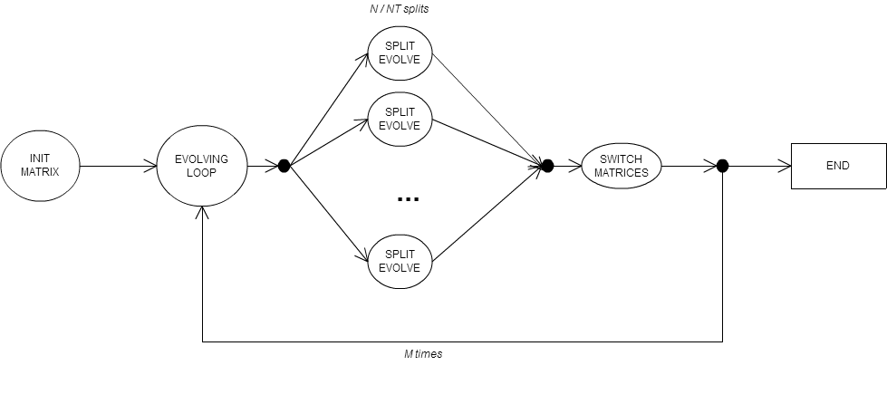
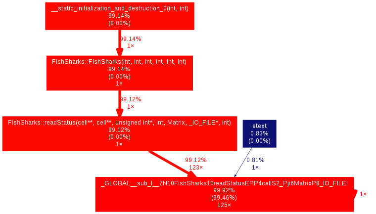
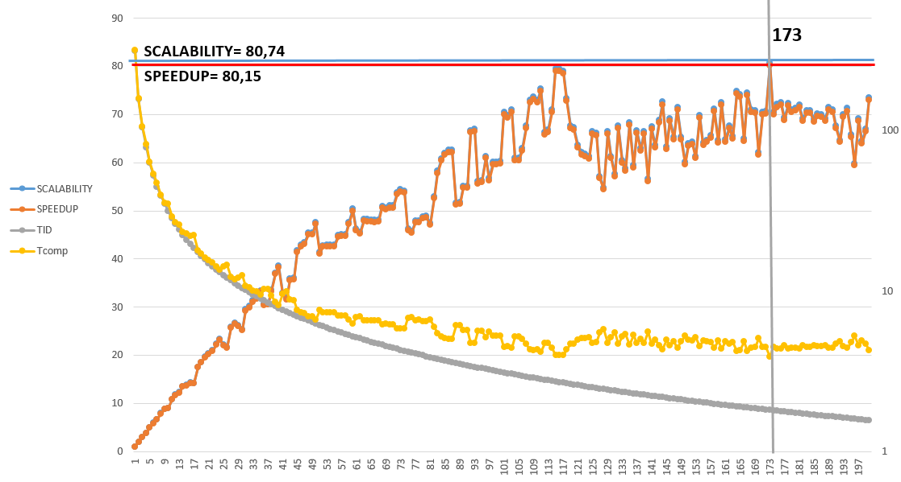
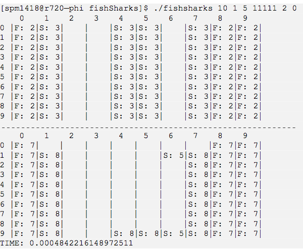

# Table of Contents
1. [Introduction](#introduction)
2. [Implementation](#implementation)
3. [Third Example](#third-example)
4. [Implementation Graph](#implementation-graph)
5. [Two matrices](#two-matrices)
6. [Vectorization](#vectorization)
7. [Source code profiling](#source-code-profiling)
8. [Random function](#random-function)
9. [Files](#files)
10. [Memory](#memory)
11. [Efficency](#efficency)
12. [How to use](#how-to-use)
13. [Test](#test)
14. [Help](#help)
15. [Export](#export)
16. [Output](#output)
# Introduction

The aim of the project is study the evolution of a population of fishes and sharks.

* The population area is represented by a NxN matrix.
* Initial matrix is composed by cells that can contain Fishes or Sharks or can be Empty

The evolution of the population follows certain rules that are applied in an iterative way.
To realize this project I have used the OpenMP framework.

There are two options to create the initial matrix: 

* Single thread creation
* Multi-thread with OpenMP

In the latter case each thread (managed by OpenMP) works

* on a single row or multiple rows (it depends on the number of rows and on the number of threads)
* on a seed number, chosen in a pseudo-random way, and assigned to each thread to fill its sub-matrix.

A fixed NxN matrix can be filled in different ways; this parametric approach is driven by the different number of threads.

In the single thread approach we have a single thread that fills the cells with the same seed number; the main matrix ends up being always the same, even if the number of threads changes. The matrix changes only if N change.
The time spent in the initial phase is negligible and, for a reasonable input of parameters it doesn’t impact the total time of computation.

# Implementation

I have used the OpenMP parallel for cycle to allocate NT threads to the cores.
```c++
//EVOLVING LOOP
for( iter=0; iter<M; iter++){

#pragma omp parallel for num threads(NT) schedule(static)
for(i=0;i<N;i++){ #pragma omp simd
    for(j=0;j<N;j++){ 
        ...
```

OpenMP creates NT threads that are used to scan the whole matrix.
In order to distribute the matrix across threads, I’ve used a Stencil pattern: each thread works on a row or group of them, and for each cell it reads the neighbors cells value and computes the new value.

# Implementation Graph

The picture shows the implemented solution:



# Two matrices

In the project I used 2 matrixes to be faster in values updating. In the initial phase the first matrix is used to build the initial matrix population, meanwhile the second matrix is only allocated.
In the following phase the two matrices are given as input parameters to the function that:

* reads the current value from the designated reading matrix
* decides how to fill in the correspondent value in the designated writing
matrix

At the end of this phase, before the next evolving step starts, the two matrices are switched, so that the old writing matrix becomes the new reading matrix.

# Vectorization

In the evolution loop I used #pragma ivdep. The compiler enforces vectorization of loops. It is designed to minimize the amount of source code changes needed in order to obtain vectorized code. With the use of vectorization hints (such as #pragma omp simd, #pragma vector always or #pragma ivdep) it vectorizes loops that the compiler does not normally auto-vectorize.
I have analyzed four different cases:

* #pragma omp simd The values of Scalability and Speedup reached with this modification are: Scalability = 75,80 , Speedup = 75,80 with 146 threads.
* #pragma vector always I had substitute the simd instruction and reach: Scalability = 80,86 and Speedup = 79,85 with 117 threads.
* #pragma ivdep I had substitute the simd instruction and reach: Scalability = 80,74 and Speedup = 80,15 with 173 threads.
* I remove this optimizations and reach: Scalability = 75,12 and Speedup = 70,32 with 148 threads.

# Source code profiling

I tried to profile the code in order to optimize it.
I used gprof 2.20.51.0.2-5.36.el6 that is present into the HOST MACHINE and I have compiled and executed the code with the configuration:

```bash
g++ fishsharks.cpp matrix.cpp −g −o fishsharks −fopenmp −std=c++0x −pg

./fishsharks 1000 8 500 11111 1 0
```

I downloaded the file gmon.out from HOST MACHINE and used the gprof2dot to represent in a simpler way the result and to better identify the part to optimize.

```bash
gprof fishsharks | gprof2dot | dot −Tpng −o output.png 
```

The result is:



for more details refer to:
```bash
gprof fishsharks gmon.out
```

# Random function

In the project I have implemented a pseudo-random generator that derives from the algebra calculus known as resto cinese.
Given a generic number *G*, co prime with *N, G* the function generates a finite cyclic group of order *N* that is Z<sub>n</sub> so G<sup>0</sup> mod n, G<sup>1</sup> mod n, G<sup>2</sup> mod n ··· G<sup>(n−1)</sup> mod n are all the numbers in Z<sub>n</sub>. But we need a non ordered sequence of numbers in the interval, so we return N mod P, where P is prime, so co prime with G and N.
The use of this function solves the problem of using rand() function that creates a very high overhead because of the lock/unlock used inside the implementation.

# Files

## fishsharks.cpp
This file contains:
* Elaboration function to the input parameters
* A function to compute the evolution loop and apply the evolution rules

## matrix.cpp
This file contains:
* The initialization function of the matrix
* The functions to interact with the matrix ( print, export, free) 
* The function for pseudo-random numbers generation

## matrix.h
This file contains:
* *SINGLE TH GENERATOR*: 1 if the initial matrix is created with single thread, 0 otherwise (multithread)
* *SEQUENTIAL EXECUTION*: 0 if OpenMP is enable, 1 for sequential execution

## fishsharks test.sh
I have also built a bash program to test and export into a file the various iterations executed with the same input parameters but with a different number of threads.
The file contains a loop that the main program executes for a given number of times *(from - to)*; it starts with a bash call.


# Memory

The main structure to represent the cell is:

```c++
/∗∗
∗ Indentify the single element
∗ − 2 bits for type of element:
∗       1 => FISH
∗       2 => SHARKS
∗ −6 bitsfortheage: 2ˆ6 = 64 << 20
∗ i use more bits than i need to reach 1 Byte per cell
∗ and simplify the allignament problem. 
∗/
struct cell{ 
    uint8 t type:2;
    uint8 t age:6; 
};
```

Cell represents the cell of the matrix that contains the current type (fish/shar- k/empty) with 2 bits and the age with 6 bits.
This struct allows to allocate for each thread about (2 ∗ N ∗ N )/N T bytes, for an input N=2048 and NT=64 there are in memory only 128 Kb that stay in the L2 cache. This optimization and the use of vectorization allow us to reach a good performance, as described before.
The two matrices are allocated in the matrix class as:
```c++
cell∗∗ M1;
cell∗∗ M2;
```

The space occupied by the structures is *∼= 2 ∗ (N ∗ N)* bytes.

# Efficency



As shown in the graph, the maximum value reached for scalability is 80,74 and speedup is 80,15 with the optimization #pragma ivdep.
But, starting from 116 the application started to increase a little bit slowly its performance.
The expected performances are in line with the achieved ones.

The complexity of the sequential algorithm is 
``` O((N ∗ N ) + N ∗ N ∗ M )```, so the complexity of the parallel algorithm is ``` O((N ∗ N ) + N ∗ N/NT ∗ M )```.
 NT
The Ideal service time (Tid) is evaluated as: ``` Tid = Tseq + Tpar/NT```  but in this specific
 NT
case I observed that the first part is negligible with respect to the parallelized part, so is possible to evaluate Tid as: ``` Tid = Tpar/NT```.

# How to use

The project is composed by one directory.
The main project could be compiled both for x86 and mic using:

* make fishsharks => for x86 execution
* make fishsharks-mic => for mic execution
* make fishsharks-test => utilty to copy fishsharks test.sh to *mic0*

With the fishsharks-mic the compiled project is automatic transferred to the *mic0* after the compilation phase.

# Test

By default, the program has been set to run into mic environment; in case you want to run it In the HOST MACHINE you have to set EXE variable as “EXE=fishsharks“.
To run the test:

```bash
spmXXX@YYYYY−mic0: ̃$ ./fishsharks test mic.sh
ERROR: # of INPUT
./fishsharks test.sh <S> <E> <N> <M> <SEED> <S>: FROM TREAD
 
<E>: TO THREAD
<N>: SIZE OF MATRIX NxN
<M>: # OF LOOPS <SEED>: SEED ROOT
```

Example: ./fishsharks test.sh 1 150 1000 500 11111
When the test is finished all the outputs are stored in the file test.txt and they have the format:

```bash
./fishsharks mic 1000 <TH> 500 11111 1 0 TH: 1
 
TIME:   334.4718639850616
TH: 2
TIME:   167.4547169208527
TH: 3
...
```

To reduce the memory occupancy the program overwrites each time the test.txt file.

# Help

```bash
[spmXXX@YYYYY fishSharks]$ ./fishsharks −−−> ERROR: ARGUMENT NUMBER NOT CORRECT
./fishsharks <N> <TH> <M> <S> <P> <E> <N>: NxN MATRIX
<TH>: # of Thread <S>: SEED ROOT
<P>: PRINT OPTION 0: NO print
1: PRINT time of phases
2: PRINT time of phases + initial and last matrix
<E>: EXPORT OPTION 0: NO export
1: EXPORT only first and last matrix
2: EXPORT first and last matrix + intermediate matrix
phases
```

# Export
If export option is selected the program generates a file with this name format: ```export < DATE > < TIME > .txt```

# Output

If print option is enabled there are 2 possibilities (1 or 2), as described in the help menu of the program.
For instance:
 * Option 1 shows this output:

```bash
[spmXXX@YYYYY fishSharks]$ ./fishsharks 10 1 5 11111 1 0 TIME: 0.0004842216148972511
```

* Option 2 shows this output:


